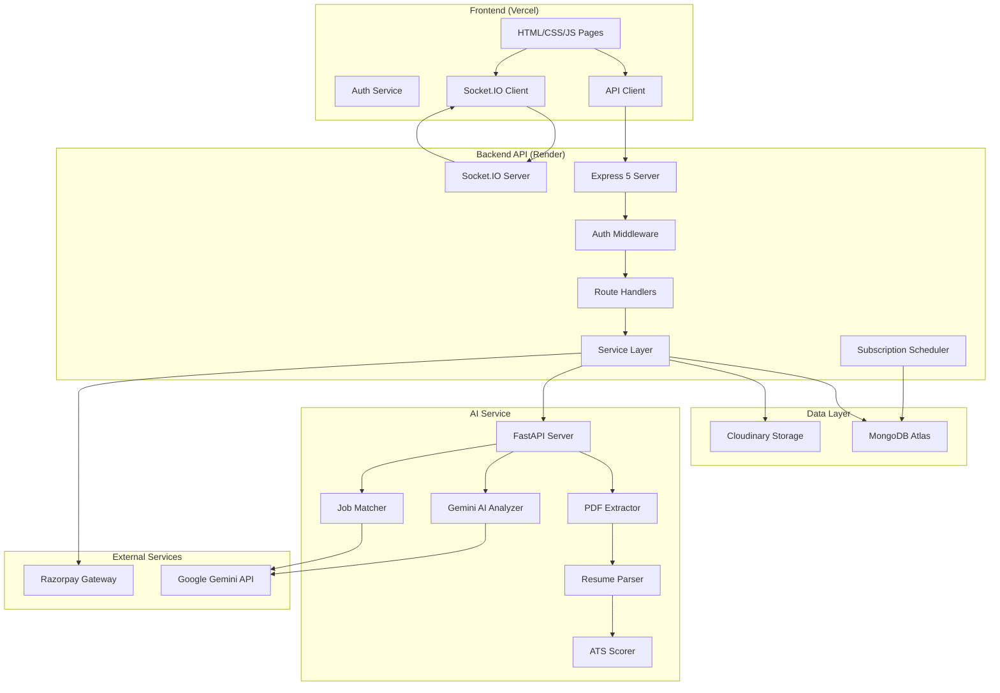
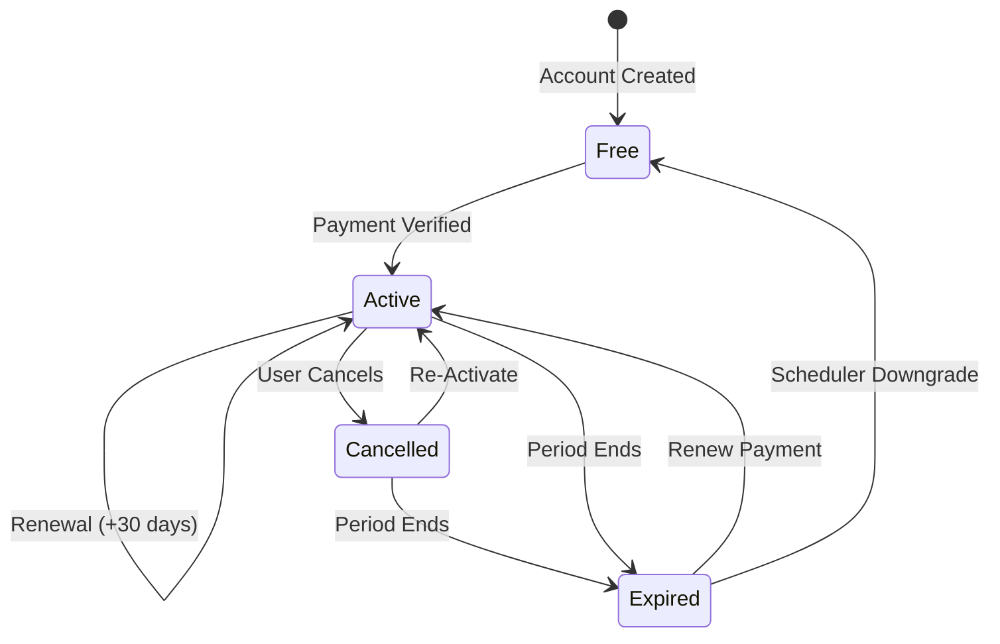

# AI Resume Analyzer & Job Matcher

> A production-deployed full-stack platform that combines deterministic ATS scoring with Google Gemini AI to analyze resumes, provide actionable improvement suggestions, and match candidates to jobs using hybrid skill-based and semantic compatibility scoring.


---

## Overview

AI Resume Analyzer is a three-tier full-stack application designed for job seekers who want data-driven feedback on their resumes. The platform extracts text from uploaded PDF resumes, runs a deterministic 7-category ATS scoring engine, and augments results with Google Gemini AI for contextual improvement suggestions and semantic job matching.

**Core User Journey:**

1. **Upload** a PDF resume → automatic text extraction and section parsing
2. **Analyze** with a dual-engine ATS scorer (deterministic metrics + Gemini AI suggestions)
3. **Match** against job listings using a hybrid 6-dimension compatibility engine
4. **Track** applications through a built-in pipeline (Applied → Interview → Offer → Hired)
5. **Receive** real-time notifications for analysis completions, job matches, and subscription events
6. **Upgrade** to Premium for unlimited analyses via Razorpay payment integration

The system is deployed with the frontend on **Vercel** and the backend API on **Render**, communicating over HTTPS with JWT + httpOnly cookie authentication.

---

## Features

### Resume Analysis
- **PDF Upload & Storage** — Upload PDF resumes with dual-mode storage (Cloudinary cloud + local fallback). File validation enforces PDF-only uploads with a configurable size limit.
- **Text Extraction** — PyMuPDF primary extraction with pdfplumber fallback ensures reliable text recovery from various PDF formats.
- **Structured Resume Parsing** — Deterministic parser segments extracted text into Contact, Summary, Skills, Experience, Education, and Projects sections using pattern matching and a comprehensive skills taxonomy.
- **7-Category ATS Scoring** — Deterministic scoring engine evaluates Section Completeness, Quantifiable Achievements, Skills & Keywords, Experience Quality, Formatting, ATS Keyword Density, and Overall Calibration, producing a 0–100 composite score.
- **AI-Powered Suggestions** — Google Gemini generates contextual improvement recommendations, bullet point rewrites, and keyword gap analysis using structured JSON output with prompt injection safeguards.
- **Analysis History** — Every analysis is persisted and accessible for comparison over time.

### Job Matching
- **Hybrid Matching Engine** — Computes compatibility scores across 6 dimensions: Skill Overlap, Experience Level, Education Fit, Industry Alignment, Location Match, and Salary Range using deterministic scoring combined with Gemini AI semantic explanations.
- **Skill Normalization** — Synonym-aware tokenizer maps variations (e.g., `React.js`, `ReactJS`, `react`) to canonical forms for accurate matching.
- **Personalized Recommendations** — Jobs are ranked by composite match score against the candidate's latest parsed resume data.
- **Deep Match Explanations** — AI-generated contextual explanations and interview preparation advice for each job match.

### Application Tracking
- **Pipeline Stages** — Track applications through Applied → Screening → Interview → Offer → Hired/Rejected stages.
- **Stage Statistics** — Aggregate counts by pipeline stage for at-a-glance progress visibility.
- **Saved/Bookmarked Jobs** — Bookmark jobs for later review with paginated retrieval.

### Notifications
- **Real-Time Alerts** — Socket.IO broadcasts notifications instantly to authenticated users via private rooms.
- **REST API** — Paginated notification retrieval with category filtering, read/unread state management, and bulk operations.
- **Automatic Triggers** — Notifications are dispatched for analysis completions, subscription activations, renewals, cancellations, and expirations.
- **Duplicate Suppression** — 3-second deduplication window prevents noise from rapid repeated events.
- **Dashboard Notification Bell** — Topbar bell icon with live unread badge count and dropdown popover for quick access.

### Subscription & Payments
- **Free Tier** — 3 resume analyses per month with basic ATS scoring.
- **Premium Pro** — 30-day unlimited access pass (₹499) with full AI suggestions, semantic matching, and unlimited analyses.
- **Razorpay Integration** — Order creation, checkout modal, cryptographic signature verification, and webhook processing.
- **Subscription Lifecycle** — Automated expiration sweep scheduler, lazy on-read expiration checks, cancellation with grace periods, renewal extensions, and stale order reconciliation.
- **Billing History** — Paginated transaction records with status tracking.

### Authentication & Security
- **Dual-Token Authentication** — JWT issued as httpOnly secure cookie and Bearer token for flexible cross-origin session handling.
- **Session Restoration** — Frontend hydrates cached user from localStorage, then verifies against backend `/api/auth/me` on page load.
- **Password Hashing** — bcrypt with salt rounds for secure credential storage.
- **Role-Based Access** — `user` and `admin` roles with middleware-enforced route protection.
- **Rate Limiting** — Configurable request throttling on all API endpoints with stricter limits on authentication routes.
- **Input Validation** — Joi schema validation on all request bodies, query parameters, and route params.
- **Security Headers** — Helmet.js with cross-origin resource policy configured for uploaded file serving.
- **Prompt Injection Protection** — AI prompts use XML boundary markers to isolate untrusted resume text from system instructions.

### Admin Panel
- **Platform Statistics** — Real-time aggregated metrics: total users, resumes, analyses, revenue, active subscriptions.
- **User Management** — Search, filter, role/plan mutation, and cascade account deletion.
- **System Health** — Live diagnostics across Express, MongoDB Atlas, and FastAPI service availability.

---

## Screenshots

> Screenshots will be added soon.

---

## Tech Stack

| Layer | Technology | Purpose |
|-------|-----------|---------|
| **Frontend** | HTML, CSS, JavaScript (ES Modules) | Single-page app UI with component-based architecture |
| **Backend API** | Node.js, Express 5 | RESTful API server with WebSocket support |
| **AI Service** | Python, FastAPI | PDF extraction, resume parsing, AI analysis, job matching |
| **Database** | MongoDB Atlas, Mongoose | Document storage for users, resumes, analyses, jobs, notifications, payments |
| **AI Provider** | Google Gemini (gemini-1.5-flash) | Contextual resume analysis and semantic job matching |
| **PDF Processing** | PyMuPDF (fitz), pdfplumber | Dual-engine PDF text extraction |
| **Real-Time** | Socket.IO | Authenticated WebSocket connections for live notifications |
| **File Storage** | Cloudinary | Cloud PDF resume storage with local fallback |
| **Payments** | Razorpay | Order creation, checkout, signature verification, webhooks |
| **Authentication** | JWT, bcryptjs, cookie-parser | Token + cookie dual auth with password hashing |
| **Validation** | Joi | Request schema validation middleware |
| **Security** | Helmet, express-rate-limit, CORS | HTTP headers, rate limiting, cross-origin policy |
| **Deployment** | Vercel (frontend), Render (backend) | Production hosting with automatic deployments |

---

## System Architecture



### Data Flow

1. **Resume Upload** — Client uploads PDF → Express validates and stores in Cloudinary → sends URL to FastAPI → PyMuPDF extracts text → Resume Parser segments sections → results stored in MongoDB.

2. **ATS Analysis** — Client triggers analysis → Express calls FastAPI with resume text → Deterministic ATS Scorer computes 7-category breakdown → Gemini AI generates suggestions → composite report stored and returned.

3. **Job Matching** — Client requests match → Express sends candidate skills + job requirements to FastAPI → Hybrid scorer computes 6-dimension compatibility → Gemini generates contextual explanation → results returned with ranked scores.

4. **Notifications** — Backend services dispatch notifications → persisted in MongoDB → emitted via Socket.IO to user's private room → client updates bell badge and popover in real time.

5. **Payments** — Client initiates upgrade → Express creates Razorpay order → Razorpay Checkout modal opens → payment signature verified server-side → subscription activated → Razorpay webhook provides async confirmation.

---

## Project Structure

```
ai-resume-analyzer/
├── client/                          # Frontend application
│   ├── index.html                   # Landing page
│   ├── css/
│   │   ├── base.css                 # Design tokens, typography, dark theme
│   │   ├── layout.css               # Grid, flexbox, app layout
│   │   ├── components.css           # Cards, buttons, badges, tables, forms
│   │   ├── utilities.css            # Spacing, display, text utilities
│   │   └── pages/                   # Page-specific styles
│   ├── js/
│   │   ├── app.js                   # Layout initializer (navbar, sidebar, notifications)
│   │   ├── api/                     # API client modules per resource
│   │   │   ├── client.js            # Centralized fetch wrapper with auth headers
│   │   │   ├── auth.api.js          # Signup, login, logout, session
│   │   │   ├── resume.api.js        # Upload, list, process resumes
│   │   │   ├── analysis.api.js      # Trigger and retrieve analyses
│   │   │   ├── job.api.js           # Job listing queries
│   │   │   ├── jobMatching.api.js   # Match scores and explanations
│   │   │   ├── application.api.js   # Application CRUD
│   │   │   ├── notification.api.js  # Notification queries and mutations
│   │   │   ├── payment.api.js       # Orders, verification, history
│   │   │   ├── savedJob.api.js      # Bookmark operations
│   │   │   ├── user.api.js          # Profile, subscription, account
│   │   │   └── admin.api.js         # Admin endpoints
│   │   ├── components/              # Reusable UI components
│   │   │   ├── navbar.js            # Top navigation bar
│   │   │   ├── sidebar.js           # App sidebar with navigation
│   │   │   ├── notifications.js     # Bell icon, badge, dropdown popover
│   │   │   ├── toast.js             # Toast notification system
│   │   │   ├── modal.js             # Modal dialog
│   │   │   ├── loader.js            # Loading states
│   │   │   └── fileUpload.js        # Drag-and-drop upload component
│   │   ├── pages/                   # Page controllers
│   │   ├── services/
│   │   │   ├── auth.service.js      # Session management, guards, state
│   │   │   └── socket.service.js    # Socket.IO client connection
│   │   └── utils/
│   │       ├── constants.js         # API base URL configuration
│   │       └── dom.js               # DOM helpers, icon rendering
│   └── pages/                       # HTML pages
│       ├── dashboard.html           # Main dashboard
│       ├── upload.html              # Resume upload
│       ├── analysis.html            # Analysis report viewer
│       ├── history.html             # Analysis history
│       ├── jobs.html                # Job listings
│       ├── job-details.html         # Job detail + match score
│       ├── saved-jobs.html          # Bookmarked jobs
│       ├── applications.html        # Application tracker
│       ├── pricing.html             # Subscription plans
│       ├── profile.html             # User profile
│       ├── settings.html            # Account settings
│       ├── login.html               # Sign in
│       ├── signup.html              # Registration
│       └── admin/                   # Admin panel pages
│
├── server/                          # Express backend API
│   ├── package.json
│   ├── .env.example                 # Environment variable template
│   └── src/
│       ├── server.js                # HTTP + WebSocket entry point
│       ├── app.js                   # Express app with middleware chain
│       ├── config/
│       │   ├── db.js                # MongoDB Atlas connection
│       │   ├── cloudinary.js        # Cloudinary SDK configuration
│       │   ├── razorpay.js          # Razorpay SDK initialization
│       │   └── socket.js            # Socket.IO server with JWT auth
│       ├── models/                  # Mongoose schemas
│       │   ├── User.js              # User, profile, subscription, usage limits
│       │   ├── Resume.js            # Uploaded resume metadata
│       │   ├── ResumeAnalysis.js    # ATS analysis results
│       │   ├── Job.js               # Job listings
│       │   ├── Application.js       # Application tracker entries
│       │   ├── SavedJob.js          # Bookmarked jobs
│       │   ├── Notification.js      # User notifications
│       │   └── Payment.js           # Payment transaction records
│       ├── routes/                  # Express route definitions
│       ├── controllers/             # Request handlers
│       ├── services/                # Business logic layer
│       │   ├── auth.service.js      # Signup, login, JWT issuance
│       │   ├── resume.service.js    # Upload, storage, deletion
│       │   ├── analysis.service.js  # AI analysis orchestration
│       │   ├── fastapi.service.js   # Inter-service communication bridge
│       │   ├── job.service.js       # Job CRUD and search
│       │   ├── jobMatching.service.js # Match orchestration
│       │   ├── application.service.js # Application pipeline
│       │   ├── notification.service.js # Create, emit, manage alerts
│       │   ├── payment.service.js   # Razorpay orders, verification, webhooks
│       │   ├── subscriptionScheduler.service.js # Background expiration sweeps
│       │   ├── savedJob.service.js  # Bookmark operations
│       │   ├── user.service.js      # Profile and account management
│       │   └── admin.service.js     # Platform analytics and user admin
│       ├── middleware/              # Express middleware
│       │   ├── auth.middleware.js   # JWT verification (cookie + Bearer)
│       │   ├── authorize.middleware.js # Role-based access control
│       │   ├── premium.middleware.js # Premium plan gate
│       │   ├── upload.middleware.js  # Multer file upload handling
│       │   ├── validate.middleware.js # Joi schema validation
│       │   ├── rateLimiter.middleware.js # Rate limiting
│       │   ├── error.middleware.js   # Centralized error handler
│       │   └── notFound.middleware.js # 404 handler
│       ├── validators/              # Joi validation schemas
│       └── utils/                   # Logger, API error class
│
├── ai-service/                      # FastAPI AI microservice
│   ├── requirements.txt             # Python dependencies
│   ├── .env.example                 # AI service environment template
│   └── app/
│       ├── main.py                  # FastAPI application entry point
│       ├── config.py                # Environment configuration
│       ├── routes/
│       │   └── resume.py            # Processing and matching endpoints
│       ├── services/
│       │   ├── pdf_extractor.py     # PyMuPDF + pdfplumber extraction
│       │   ├── resume_parser.py     # Deterministic section parser
│       │   ├── ats_scorer.py        # 7-category ATS scoring engine
│       │   ├── ai_analyzer.py       # Gemini AI analysis integration
│       │   └── job_matcher.py       # Hybrid 6-dimension matching engine
│       ├── schemas/                 # Pydantic request/response models
│       ├── middleware/              # API key authentication
│       └── utils/                   # Text cleaning utilities
│
├── .gitignore
└── README.md
```

---

## Getting Started

### Prerequisites

- **Node.js** v18 or later
- **Python** v3.10 or later
- **MongoDB** Atlas cluster (or local MongoDB instance)
- **Git**

Optional for full functionality:
- Cloudinary account (resume file storage)
- Google Gemini API key (AI analysis)
- Razorpay test/live keys (payment processing)

### 1. Clone the Repository

```bash
git clone https://github.com/lokeshsahu2804-korba/ai-resume-analyzer.git
cd ai-resume-analyzer
```

### 2. Start the Express Backend

```bash
cd server
cp .env.example .env
# Edit .env with your MongoDB URI, JWT secret, and other configuration
npm install
npm run dev
```

The server starts on `http://localhost:5001` (port 5001 because macOS reserves 5000 for AirPlay).

### 3. Start the FastAPI AI Service

```bash
cd ai-service
cp .env.example .env
# Edit .env with your Gemini API key and internal API key
python3 -m venv venv
source venv/bin/activate
pip install -r requirements.txt
uvicorn app.main:app --reload --reload-dir app --port 8000
```

The AI service starts on `http://localhost:8000`.

### 4. Serve the Frontend

```bash
cd client
python3 -m http.server 5500
```

Open `http://localhost:5500` in your browser.

### Health Checks

| Service | URL |
|---------|-----|
| Express API | `http://localhost:5001/api/health` |
| FastAPI AI | `http://localhost:8000/health` |

---

## Environment Variables

### Server (`server/.env`)

| Variable | Purpose | Required |
|----------|---------|----------|
| `PORT` | Express server port (default: 5001) | No |
| `NODE_ENV` | Environment mode (`development` / `production`) | No |
| `CLIENT_URL` | Frontend origin for CORS (default: `http://localhost:5500`) | Yes |
| `FASTAPI_URL` | AI service URL (default: `http://localhost:8000`) | Yes |
| `INTERNAL_API_KEY` | Shared secret for Express ↔ FastAPI communication | Yes |
| `MONGODB_URI` | MongoDB Atlas connection string | Yes |
| `JWT_SECRET` | Secret key for JWT signing (min 32 chars) | Yes |
| `JWT_EXPIRES_IN` | Token expiration duration (default: `7d`) | No |
| `COOKIE_EXPIRES_DAYS` | Cookie expiration in days (default: `7`) | No |
| `CLOUDINARY_CLOUD_NAME` | Cloudinary cloud name | Yes |
| `CLOUDINARY_API_KEY` | Cloudinary API key | Yes |
| `CLOUDINARY_API_SECRET` | Cloudinary API secret | Yes |
| `MAX_FILE_SIZE_MB` | Maximum upload size in MB (default: `5`) | No |
| `RAZORPAY_KEY_ID` | Razorpay key ID (test or live) | Yes |
| `RAZORPAY_KEY_SECRET` | Razorpay key secret | Yes |
| `RAZORPAY_WEBHOOK_SECRET` | Razorpay webhook signature secret | Yes |
| `RATE_LIMIT_WINDOW_MS` | Rate limit window in ms (default: `900000`) | No |
| `RATE_LIMIT_MAX` | Max requests per window (default: `100`) | No |

### AI Service (`ai-service/.env`)

| Variable | Purpose | Required |
|----------|---------|----------|
| `FASTAPI_PORT` | FastAPI server port (default: `8000`) | No |
| `INTERNAL_API_KEY` | Must match the server's `INTERNAL_API_KEY` | Yes |
| `GEMINI_API_KEY` | Google Gemini API key | Yes |
| `GEMINI_MODEL` | Gemini model name (default: `gemini-1.5-flash`) | No |

> **Note:** `.env` files are gitignored. Use the provided `.env.example` files as templates. Never commit secrets.

---

## API Overview

All endpoints are prefixed with `/api`.

### Authentication

| Method | Endpoint | Description | Access |
|--------|----------|-------------|--------|
| POST | `/auth/signup` | Register new account | Public |
| POST | `/auth/login` | Authenticate and issue token | Public |
| POST | `/auth/logout` | Clear session cookie | Public |
| GET | `/auth/me` | Get current user session | Protected |

### Users

| Method | Endpoint | Description | Access |
|--------|----------|-------------|--------|
| GET | `/users/me` | Get user profile | Protected |
| PUT | `/users/profile` | Update profile details | Protected |
| PUT | `/users/password` | Change password | Protected |
| GET | `/users/subscription` | Get subscription status and usage | Protected |
| DELETE | `/users/account` | Delete account | Protected |

### Resumes

| Method | Endpoint | Description | Access |
|--------|----------|-------------|--------|
| POST | `/resumes/upload` | Upload PDF resume | Protected |
| POST | `/resumes/:id/process` | Trigger text extraction | Protected |
| GET | `/resumes` | List user's resumes | Protected |
| GET | `/resumes/:id` | Get resume details | Protected |
| DELETE | `/resumes/:id` | Delete resume | Protected |

### Analyses

| Method | Endpoint | Description | Access |
|--------|----------|-------------|--------|
| POST | `/analyses/resume/:resumeId` | Run AI ATS analysis | Protected |
| GET | `/analyses` | List analysis history | Protected |
| GET | `/analyses/resume/:resumeId/latest` | Get latest analysis for resume | Protected |
| GET | `/analyses/:id` | Get analysis report | Protected |

### Jobs

| Method | Endpoint | Description | Access |
|--------|----------|-------------|--------|
| GET | `/jobs` | Search job listings | Public |
| GET | `/jobs/recommended` | Get personalized job matches | Protected |
| GET | `/jobs/:id` | Get job details | Public |
| GET | `/jobs/:id/match` | Get compatibility score | Protected |
| GET | `/jobs/:id/match-explanation` | Get AI match explanation | Protected |
| POST | `/jobs/:id/save` | Bookmark a job | Protected |
| DELETE | `/jobs/:id/save` | Remove bookmark | Protected |
| POST | `/jobs` | Create job listing | Admin |
| PUT | `/jobs/:id` | Update job listing | Admin |
| DELETE | `/jobs/:id` | Delete job listing | Admin |

### Applications

| Method | Endpoint | Description | Access |
|--------|----------|-------------|--------|
| GET | `/applications` | List applications with filters | Protected |
| GET | `/applications/stats` | Get pipeline stage counts | Protected |
| POST | `/applications` | Submit application | Protected |
| GET | `/applications/:id` | Get application details | Protected |
| PUT | `/applications/:id` | Update status/notes | Protected |
| DELETE | `/applications/:id` | Withdraw application | Protected |

### Notifications

| Method | Endpoint | Description | Access |
|--------|----------|-------------|--------|
| GET | `/notifications` | List paginated notifications | Protected |
| GET | `/notifications/unread-count` | Get unread count | Protected |
| PUT | `/notifications/:id/read` | Mark as read | Protected |
| PUT | `/notifications/read-all` | Mark all as read | Protected |
| DELETE | `/notifications/:id` | Delete notification | Protected |
| DELETE | `/notifications` | Clear notifications | Protected |

### Payments & Subscriptions

| Method | Endpoint | Description | Access |
|--------|----------|-------------|--------|
| POST | `/payments/create-order` | Create Razorpay order | Protected |
| POST | `/payments/verify` | Verify payment signature | Protected |
| GET | `/payments` | List payment history | Protected |
| GET | `/payments/:id` | Get payment details | Protected |
| POST | `/payments/cancel-subscription` | Cancel subscription | Protected |
| POST | `/payments/webhook` | Razorpay webhook receiver | Public (signature-verified) |

### Admin

| Method | Endpoint | Description | Access |
|--------|----------|-------------|--------|
| GET | `/admin/stats` | Platform statistics | Admin |
| GET | `/admin/health-check` | System health report | Admin |
| GET | `/admin/users` | List users with filters | Admin |
| GET | `/admin/users/:id` | User details | Admin |
| PUT | `/admin/users/:id/role` | Update user role | Admin |
| PUT | `/admin/users/:id/plan` | Update user plan | Admin |
| DELETE | `/admin/users/:id` | Delete user (cascade) | Admin |

---

## AI Analysis Pipeline

```
PDF Resume
  │
  ▼
┌──────────────────────────────────────────────────────┐
│  PDF Extractor (PyMuPDF + pdfplumber fallback)       │
│  → Downloads from Cloudinary URL or local path       │
│  → Extracts UTF-8 text with page/word counts         │
└──────────────────────┬───────────────────────────────┘
                       │
                       ▼
┌──────────────────────────────────────────────────────┐
│  Resume Parser                                       │
│  → Extracts: Name, Email, Phone, LinkedIn, GitHub    │
│  → Segments: Summary, Skills, Experience, Education  │
│  → Categorizes skills via taxonomy (200+ terms)      │
└──────────────────────┬───────────────────────────────┘
                       │
              ┌────────┴────────┐
              ▼                 ▼
┌─────────────────────┐ ┌─────────────────────────────┐
│  Deterministic ATS  │ │  Gemini AI Analyzer         │
│  Scorer (7 cats)    │ │  → Structured JSON output   │
│  → Section Complete │ │  → Contextual suggestions   │
│  → Achievements     │ │  → Bullet point rewrites    │
│  → Skills/Keywords  │ │  → Keyword gap analysis     │
│  → Experience       │ │  → Prompt injection guards  │
│  → Formatting       │ └─────────────────────────────┘
│  → ATS Density      │
│  → Calibration      │
└─────────────────────┘
              │
              ▼
    Composite ATS Report (0-100)
    stored in MongoDB
```

### Job Matching Engine

The hybrid matching engine computes compatibility across 6 dimensions:

| Dimension | Method |
|-----------|--------|
| **Skill Overlap** | Synonym-normalized set intersection with coverage percentage |
| **Experience Level** | Mapped level comparison (entry → junior → mid → senior → lead) |
| **Education Fit** | Degree and field alignment scoring |
| **Industry Alignment** | Domain keyword matching |
| **Location Match** | Location and remote-work compatibility |
| **Salary Range** | Expected vs. offered range overlap |

Deterministic scores are augmented with Gemini AI contextual explanations, interview preparation tips, and skill gap recommendations.

---

## Subscription Lifecycle



- **Free Tier** — 3 analyses/month, basic ATS score, deterministic keyword matching.
- **Premium Pro** — ₹499 for 30-day unlimited access, full AI suggestions, semantic matching.
- **Grace Period** — Cancelled subscriptions retain Premium access until the billing period ends.
- **Automated Expiration** — Background scheduler sweeps for expired subscriptions and downgrades accounts. Lazy on-read checks provide additional safety.
- **Webhook Reconciliation** — Razorpay webhooks are processed idempotently alongside client-side verification for fault tolerance.
- **Stale Order Cleanup** — Unpaid orders older than 24 hours are reconciled to `failed` status.

---

## Testing

The repository includes integration test suites that validate end-to-end behavior against the running backend:

```bash
# Authentication API (11 tests)
node scratch/test_auth_api.js

# Notification System (24 tests)
node scratch/test_phase14_notifications.js

# Subscription Lifecycle & Billing (25 tests)
node scratch/test_phase16_subscription.js
```

Test suites cover:
- User signup, login, logout, and session verification
- Protected route enforcement and role-based access
- Notification creation, retrieval, read state, deletion, and Socket.IO emission
- Subscription activation, renewal, expiration sweeps, cancellation grace periods
- Razorpay order creation, payment verification, webhook processing
- Idempotent reconciliation flows and stale order cleanup
- Admin cascade deletion of user accounts and dependent records

---

## Production Hardening

The production deployment underwent iterative hardening to resolve cross-origin, authentication, and module loading challenges.

### Cross-Origin Authentication
JWT authentication was made reliable across the Vercel frontend and Render backend by implementing a dual-token strategy: httpOnly cookies for same-origin requests and Bearer tokens stored in localStorage for cross-origin API calls.

### Centralized API Configuration
The frontend API client explicitly imports the configured API base URL as an ES module rather than depending on global variables set by classic script tags. This ensures correct routing in both local development (`localhost:5001`) and production (`render.com`).

### ES Module Safety
All shared JavaScript modules use proper ES module `import`/`export` syntax. HTML pages load scripts exclusively with `type="module"` to avoid `SyntaxError: Unexpected token 'export'` from classic script loading.

### Authentication State Initialization
Pages that depend on user session state (dashboard, pricing, notifications) await `authService.initAuth()` before rendering authenticated UI, preventing race conditions between module loading and DOM hydration.

### Subscription API Routing
Subscription status queries route through the centralized API client layer, ensuring Bearer token attachment and correct base URL resolution instead of using relative `fetch()` calls that fail on cross-origin deployments.

### Notification Reliability
The notification system was verified with 24 integration tests covering REST queries, real-time Socket.IO emission, unread badge counters, category filtering, and TTL cleanup. The dashboard notification bell is the primary notification entry point.

---

## Deployment

### Architecture

| Component | Platform | URL Pattern |
|-----------|----------|-------------|
| Frontend | Vercel | `https://<project>.vercel.app` |
| Backend API | Render | `https://<service>.onrender.com` |
| Database | MongoDB Atlas | Managed cluster |
| File Storage | Cloudinary | Managed CDN |
| AI Service | Render / Local | Configurable via `FASTAPI_URL` |

### Production Deployment Checklist

1. **Backend (Render)**
   - Set all environment variables from `server/.env.example`
   - Set `NODE_ENV=production`
   - Set `CLIENT_URL` to your Vercel frontend URL
   - Build command: `npm install`
   - Start command: `node src/server.js`

2. **Frontend (Vercel)**
   - Deploy the `client/` directory
   - Update `client/js/utils/constants.js` with the production backend URL
   - No build step required (static HTML/CSS/JS)

3. **AI Service**
   - Deploy with `uvicorn app.main:app --host 0.0.0.0 --port $PORT`
   - Set `INTERNAL_API_KEY` to match the backend's key
   - Set `GEMINI_API_KEY` for AI functionality

4. **MongoDB Atlas**
   - Whitelist Render's outbound IPs in Atlas Network Access
   - Ensure the connection string uses `retryWrites=true&w=majority`

5. **Razorpay**
   - Configure webhook URL: `https://<backend>/api/payments/webhook`
   - Enable `payment.captured`, `payment.failed`, and `refund.processed` events

---

## Troubleshooting

| Issue | Check |
|-------|-------|
| **CORS errors** | Verify `CLIENT_URL` in server `.env` matches the exact frontend origin (including protocol and port) |
| **Auth not persisting** | Confirm `credentials: 'include'` in fetch calls and `credentials: true` in CORS config |
| **API calls return 404** | Verify `API_BASE_URL` in `client/js/utils/constants.js` points to the correct backend |
| **Socket.IO won't connect** | Check that the backend Socket.IO CORS origin list includes the frontend URL |
| **Razorpay modal not opening** | Ensure the Razorpay checkout script is loaded and `RAZORPAY_KEY_ID` is set on the backend |
| **AI analysis fails** | Verify `INTERNAL_API_KEY` matches between server and ai-service, and `GEMINI_API_KEY` is valid |
| **PDF extraction errors** | Check that PyMuPDF and pdfplumber are installed: `pip install pymupdf pdfplumber` |
| **MongoDB connection fails** | Whitelist your IP in Atlas Network Access and verify the connection string |

---

## Roadmap

- [x] User authentication with JWT + httpOnly cookies
- [x] PDF resume upload with Cloudinary storage
- [x] AI-powered resume analysis with 7-category ATS scoring
- [x] Google Gemini integration for contextual suggestions
- [x] Hybrid job matching engine with 6-dimension scoring
- [x] Application tracking pipeline
- [x] Real-time notification system with Socket.IO
- [x] Razorpay payment integration with subscription lifecycle
- [x] Admin dashboard with platform analytics
- [x] Production deployment on Vercel + Render
- [ ] Email notification delivery
- [ ] Resume template generation and export
- [ ] Multi-resume comparison dashboard
- [ ] Enhanced mobile-responsive layouts
- [ ] Recruiter portal and job posting workflow
- [ ] OAuth social login (Google, GitHub)
- [ ] Automated weekly career insight reports

---

## Contributing

1. Fork the repository
2. Create a feature branch: `git checkout -b feat/your-feature`
3. Make changes and run relevant tests
4. Commit with a descriptive message: `git commit -m "feat: add your feature"`
5. Push to your fork: `git push origin feat/your-feature`
6. Open a Pull Request against the `main` branch

Please follow the existing commit message convention: `feat:`, `fix:`, `chore:`, `test:`, `docs:`.

---

## License

This project is for educational and portfolio purposes.

---

## Author

**Lokesh Kumar Sahu**
- GitHub: [@lokeshsahu2804-korba](https://github.com/lokeshsahu2804-korba)
